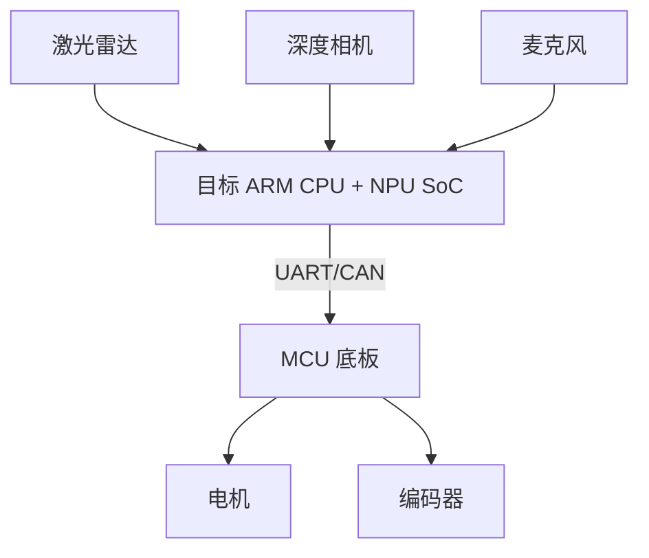

# 机器人平台迁移白皮书大纲

## 目的

本文档用于总结从 RDK X5 到公司自研 ARM CPU + NPU SoC 的迁移过程。它既服务项目交付、后续维护，也服务你的职业表达。

## 1. 摘要

- 为什么需要迁移。
- 迁移了哪些模块。
- 迁移完成后的系统能力。
- 主要风险以及解决方式。

## 2. 硬件架构

需要包含：

- 目标 SoC。
- MCU 底板。
- 激光雷达。
- 深度相机。
- 麦克风/音频链路。
- 电机、编码器、电源。
- UART/CAN 通信。

架构图：



## 3. 软件架构

需要包含：

- Ubuntu 镜像。
- ROS2 发行版。
- DDS 实现。
- SLAM/定位。
- Nav2。
- YOLO/NPU。
- ASR/任务管理。
- 底盘控制器与 MCU 协议。

## 4. 迁移范围

| 模块 | RDK X5 状态 | 目标 SoC 状态 | 负责人 | 状态 |
| --- | --- | --- | --- | --- |
| SLAM |  |  |  |  |
| Localization |  |  |  |  |
| Nav2 |  |  |  |  |
| Lidar |  |  |  |  |
| Depth camera |  |  |  |  |
| YOLO/NPU |  |  |  |  |
| ASR |  |  |  |  |
| MCU communication |  |  |  |  |

## 5. 接口契约

需要记录：

- Topic 名称与消息类型。
- QoS 要求。
- TF 坐标系。
- Action/Service API。
- MCU 协议。
- AI 检测消息。
- Task Manager 输入与输出。

## 6. 平台差异

总结实测差异：

- CPU。
- 内存。
- NPU runtime。
- 驱动行为。
- ROS2 包兼容性。
- DDS 行为。
- 传感器时间戳行为。
- 温度与功耗。

## 7. 关键问题与解决方案

用短案例记录：

| 问题 | 层级 | 根因 | 修复方案 | 证据 |
| --- | --- | --- | --- | --- |
|  |  |  |  |  |

## 8. 性能基线

需要包含：

- 节点 CPU/内存。
- Topic 频率。
- SLAM/Nav2 延迟。
- YOLO FPS 与延迟。
- 长稳测试。
- RDK X5 与目标 SoC 对比。

## 9. 导航验证

需要包含：

- 测试地图。
- 测试场景。
- 成功/失败标准。
- 通过率。
- 已知限制。

## 10. AI 与任务集成

需要包含：

- YOLO 输出契约。
- 深度融合方式。
- Object 到 Task 的转换。
- AI 延迟对导航的影响。
- 安全边界。

## 11. 剩余风险

示例：

- 传感器驱动稳定性。
- CPU/NPU 资源竞争。
- 特定场景下的定位漂移。
- TF/时间同步。
- MCU 通信可靠性。
- 长时间运行内存增长。

## 12. 下一轮迭代路线

分开记录：

- 发布前必须修复。
- 性能优化。
- 架构清理。
- 未来 AI/机器人功能。

## 职业表达示例

可以作为简历或面试表达的起点：

```text
参与 ROS2 机器人软件栈从 RDK X5 到公司自研 ARM CPU + NPU SoC 平台的迁移。负责建图、定位、Nav2 导航链路、ROS2 Graph 分析和平台适配问题定位。沉淀了覆盖 TF、Topic/Action/Service 链路、SLAM/Nav2 故障诊断、性能基线、长稳测试和 AI 感知集成边界的系统级调试资产。
```
