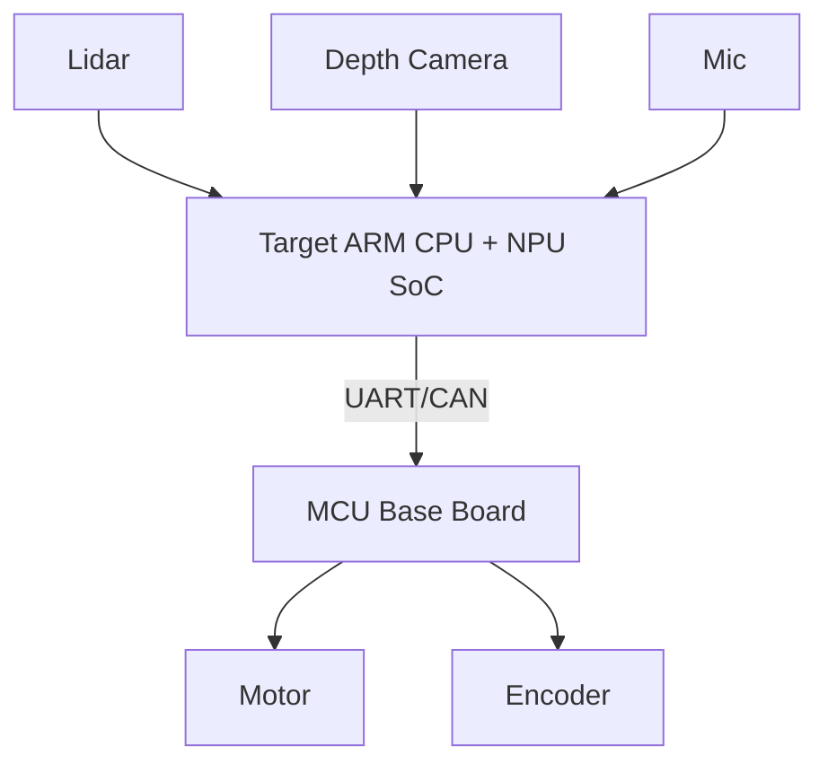

# Robot Platform Migration White Paper Outline

## Purpose

This white paper should summarize the migration from RDK X5 to the company ARM
CPU + NPU SoC in a way that is useful for project delivery, future maintenance,
and career presentation.

## 1. Executive summary

- Why the migration was needed.
- What was migrated.
- Final system capability.
- Main risks and how they were solved.

## 2. Hardware architecture

Include:

- Target SoC.
- MCU base board.
- Lidar.
- Depth camera.
- Microphone/audio path.
- Motor, encoder, power.
- UART/CAN communication.

Diagram:



## 3. Software architecture

Include:

- Ubuntu image.
- ROS2 distribution.
- DDS implementation.
- SLAM/localization.
- Nav2.
- YOLO/NPU.
- ASR/task manager.
- Base controller and MCU protocol.

## 4. Migration scope

| Module | RDK X5 state | Target SoC state | Owner | Status |
| --- | --- | --- | --- | --- |
| SLAM |  |  |  |  |
| Localization |  |  |  |  |
| Nav2 |  |  |  |  |
| Lidar |  |  |  |  |
| Depth camera |  |  |  |  |
| YOLO/NPU |  |  |  |  |
| ASR |  |  |  |  |
| MCU communication |  |  |  |  |

## 5. Interface contracts

Document:

- Topic names and message types.
- QoS requirements.
- TF frames.
- Action/service APIs.
- MCU protocol.
- AI detection message.
- Task manager inputs/outputs.

## 6. Platform differences

Summarize measured differences:

- CPU.
- Memory.
- NPU runtime.
- Driver behavior.
- ROS2 package compatibility.
- DDS behavior.
- Sensor timestamp behavior.
- Thermal and power.

## 7. Key problems and solutions

Use short case studies:

| Problem | Layer | Root cause | Fix | Evidence |
| --- | --- | --- | --- | --- |
|  |  |  |  |  |

## 8. Performance baseline

Include:

- Node CPU/memory.
- Topic rates.
- SLAM/Nav2 latency.
- YOLO FPS and latency.
- Long-run stability.
- RDK X5 vs target SoC comparison.

## 9. Navigation validation

Include:

- Test map.
- Test scenarios.
- Success/failure criteria.
- Pass rate.
- Known limitations.

## 10. AI and task integration

Include:

- YOLO output contract.
- Depth fusion method.
- Object-to-task conversion.
- AI latency impact on navigation.
- Safety boundaries.

## 11. Remaining risks

Examples:

- Sensor driver stability.
- CPU/NPU contention.
- Localization drift in specific scenes.
- TF/time synchronization.
- MCU communication reliability.
- Long-run memory growth.

## 12. Next iteration roadmap

Separate:

- Must fix before release.
- Performance optimization.
- Architecture cleanup.
- Future AI/robotics features.

## Career summary paragraph

Use this paragraph as a resume/interview seed:

```text
Participated in migration of a ROS2 robot software stack from RDK X5 to a
company ARM CPU + NPU SoC platform. Owned mapping, localization, Nav2 navigation
chain, ROS2 graph analysis, and platform adaptation issues. Built system-level
debugging assets covering TF, Topic/Action/Service flows, SLAM/Nav2 failure
diagnosis, performance baselines, long-run stability, and AI perception
integration boundaries.
```
