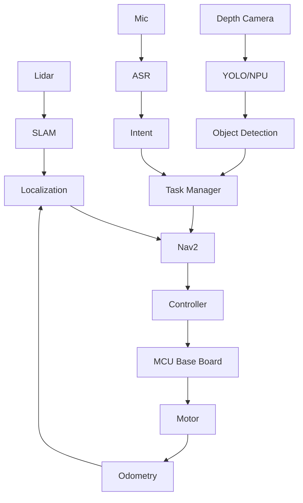

# Robot System Map

## Purpose

This document is the first artifact for understanding the whole robot system.
It should be updated whenever nodes, topics, hardware interfaces, launch files,
or platform assumptions change.

## Responsibility boundary

Owner scope:

- SLAM and map building
- Localization
- Nav2 navigation chain
- ROS2 graph analysis
- Target ARM CPU + NPU SoC adaptation
- Integration boundaries with MCU, YOLO/NPU/depth camera, and ASR

Adjacent owners:

- YOLO, NPU inference optimization, depth camera: teammate A
- Audio, ASR, voice interaction: teammate B

## High-level architecture



## ROS graph inventory template

Capture this table on both RDK X5 and the target SoC.

| Node | Package | Process | Inputs | Outputs | Services | Actions | Rate | Owner | Notes |
| --- | --- | --- | --- | --- | --- | --- | --- | --- | --- |
| `/slam_toolbox` | TBD | TBD | `/scan`, `/tf`, `/odom` | `/map`, `/tf` | TBD | TBD | TBD | Owner | Fill from `ros2 node info` |
| `/map_server` | TBD | TBD | map file | `/map` | TBD | TBD | TBD | Owner | Fill after launch |
| `/controller_server` | Nav2 | TBD | `/cmd_vel`, costmap | `/cmd_vel` | TBD | TBD | TBD | Owner | Verify actual topic direction |
| `/bt_navigator` | Nav2 | TBD | goal action | Nav action | TBD | `navigate_to_pose` | TBD | Owner | Fill after launch |
| `/base_controller` | TBD | TBD | `/cmd_vel` | `/odom`, MCU commands | TBD | TBD | TBD | Owner/MCU | Platform critical |
| `/yolo_node` | TBD | TBD | camera image | object detection topic | TBD | TBD | TBD | Teammate A | Interface dependency |
| `/asr_node` | TBD | TBD | audio stream | intent/task topic | TBD | TBD | TBD | Teammate B | Interface dependency |

Commands:

```bash
ros2 node list
ros2 node info /node_name
ros2 topic list -t
ros2 service list -t
ros2 action list -t
rqt_graph
```

## Topic inventory template

| Topic | Type | Publisher | Subscriber | Expected rate | Actual rate | Bandwidth | QoS | Failure symptom |
| --- | --- | --- | --- | --- | --- | --- | --- | --- |
| `/scan` | `sensor_msgs/msg/LaserScan` | Lidar node | SLAM/Localization/Costmap | TBD | TBD | TBD | TBD | No map update, no obstacle |
| `/odom` | `nav_msgs/msg/Odometry` | Base controller | Localization/Nav2 | TBD | TBD | TBD | TBD | Drift, controller failure |
| `/tf` | `tf2_msgs/msg/TFMessage` | Multiple | Multiple | TBD | TBD | TBD | TBD | Transform unavailable |
| `/tf_static` | `tf2_msgs/msg/TFMessage` | Static TF | Multiple | Once | TBD | TBD | transient local | Sensor frame missing |
| `/map` | `nav_msgs/msg/OccupancyGrid` | SLAM/Map server | Nav2/RViz | TBD | TBD | TBD | TBD | No global planning |
| `/cmd_vel` | `geometry_msgs/msg/Twist` | Nav2 controller | Base controller | TBD | TBD | TBD | TBD | Robot does not move |
| object detection topic | TBD | YOLO node | Task/decision | TBD | TBD | TBD | TBD | AI result not used |

Commands:

```bash
ros2 topic info /topic_name
ros2 topic hz /topic_name
ros2 topic bw /topic_name
ros2 topic echo /topic_name --once
```

## TF tree baseline

Expected minimum tree:

```text
map
└── odom
    └── base_link
        ├── laser
        └── camera_link
```

Checklist:

- `map -> odom` is produced by localization or SLAM.
- `odom -> base_link` is produced by odometry or base controller.
- `base_link -> laser` is static and matches real mounting.
- `base_link -> camera_link` is static and matches real mounting.
- All sensor messages use the correct `frame_id`.
- Message timestamps are close to system time and do not jump.

Commands:

```bash
ros2 run tf2_tools view_frames
ros2 run tf2_ros tf2_echo map base_link
ros2 run tf2_ros tf2_echo base_link laser
```

## RDK X5 vs target SoC difference list

| Area | RDK X5 baseline | Target SoC | Risk | Evidence |
| --- | --- | --- | --- | --- |
| CPU cores/frequency | TBD | TBD | Scheduling and latency | `lscpu`, `top` |
| Memory size/bandwidth | TBD | TBD | SLAM/Nav2/camera pressure | `free`, `vmstat` |
| NPU runtime | TBD | TBD | YOLO deployment | NPU SDK logs |
| Camera interface | TBD | TBD | Frame drops, timestamp issues | driver logs, topic hz |
| Lidar interface | TBD | TBD | Scan loss | topic hz, dmesg |
| MCU link | UART/CAN TBD | UART/CAN TBD | Control latency, packet loss | serial/CAN logs |
| Ubuntu version | TBD | TBD | ROS2 dependency | `lsb_release -a` |
| ROS2 distribution | TBD | TBD | Package compatibility | `ros2 --version`, apt |
| DDS implementation | TBD | TBD | QoS and latency | env, package list |

## Failure classification

Use this before debugging deeply:

| Layer | Typical symptom | First evidence to collect |
| --- | --- | --- |
| Hardware/interface | Device absent, unstable data, packet loss | `dmesg`, bus logs, topic rate |
| Driver/platform | Node cannot open device, high CPU, timestamp issue | driver logs, permissions, strace |
| ROS2 communication | Topic missing, QoS mismatch, late messages | `ros2 topic info`, QoS, rosbag |
| TF/time | Transform unavailable, jumps, extrapolation error | `tf2_echo`, message timestamps |
| SLAM/localization | Map drift, pose jump, lost localization | `/scan`, `/odom`, `/tf`, SLAM logs |
| Nav2/planning | No path, path through obstacle, recovery loop | costmap, planner logs, BT status |
| Control/MCU | `/cmd_vel` exists but robot does not move | MCU log, odom, motor command |
| AI/task | Object or voice result not triggering action | detection/intent topic, task logs |

## First-week deliverables

- Export current ROS graph as image.
- Save TF tree PDF or screenshot.
- Complete node/topic/action/service inventory.
- Record one rosbag containing lidar, odom, tf, map, cmd_vel, and goal action.
- Produce the first platform difference list with measured data.
