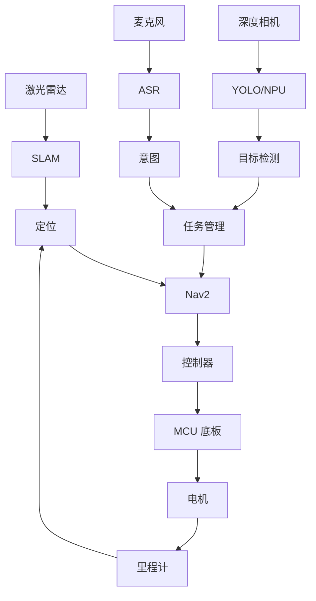

# 机器人系统地图

## 目的

本文档是理解整套机器人系统的第一个工程资产。当节点、话题、硬件接口、启动文件或平台假设发生变化时，都应该同步更新本文档。

## 职责边界

你的负责范围：

- SLAM 与地图构建
- 定位
- Nav2 导航链路
- ROS2 Graph 分析
- 目标 ARM CPU + NPU SoC 适配
- 与 MCU、YOLO/NPU/深度相机、ASR 的集成边界

相邻负责人：

- YOLO、NPU 推理优化、深度相机：同事 A
- 音频、ASR、语音交互：同事 B

## 高层架构



## ROS Graph 盘点模板

在 RDK X5 和目标 SoC 上都要采集这张表。

| Node | Package | Process | 输入 | 输出 | Service | Action | 频率 | 负责人 | 备注 |
| --- | --- | --- | --- | --- | --- | --- | --- | --- | --- |
| `/slam_toolbox` | 待补充 | 待补充 | `/scan`, `/tf`, `/odom` | `/map`, `/tf` | 待补充 | 待补充 | 待补充 | 你 | 从 `ros2 node info` 填写 |
| `/map_server` | 待补充 | 待补充 | map file | `/map` | 待补充 | 待补充 | 待补充 | 你 | 启动后填写 |
| `/controller_server` | Nav2 | 待补充 | `/cmd_vel`, costmap | `/cmd_vel` | 待补充 | 待补充 | 待补充 | 你 | 核对真实话题方向 |
| `/bt_navigator` | Nav2 | 待补充 | goal action | Nav action | 待补充 | `navigate_to_pose` | 待补充 | 你 | 启动后填写 |
| `/base_controller` | 待补充 | 待补充 | `/cmd_vel` | `/odom`, MCU commands | 待补充 | 待补充 | 待补充 | 你/MCU | 平台关键链路 |
| `/yolo_node` | 待补充 | 待补充 | camera image | object detection topic | 待补充 | 待补充 | 待补充 | 同事 A | 接口依赖 |
| `/asr_node` | 待补充 | 待补充 | audio stream | intent/task topic | 待补充 | 待补充 | 待补充 | 同事 B | 接口依赖 |

常用命令：

```bash
ros2 node list
ros2 node info /node_name
ros2 topic list -t
ros2 service list -t
ros2 action list -t
rqt_graph
```

## Topic 盘点模板

| Topic | Type | Publisher | Subscriber | 期望频率 | 实测频率 | 带宽 | QoS | 故障现象 |
| --- | --- | --- | --- | --- | --- | --- | --- | --- |
| `/scan` | `sensor_msgs/msg/LaserScan` | Lidar node | SLAM/Localization/Costmap | 待补充 | 待补充 | 待补充 | 待补充 | 地图不更新、障碍物缺失 |
| `/odom` | `nav_msgs/msg/Odometry` | Base controller | Localization/Nav2 | 待补充 | 待补充 | 待补充 | 待补充 | 漂移、控制异常 |
| `/tf` | `tf2_msgs/msg/TFMessage` | 多个节点 | 多个节点 | 待补充 | 待补充 | 待补充 | 待补充 | Transform 不可用 |
| `/tf_static` | `tf2_msgs/msg/TFMessage` | Static TF | 多个节点 | 一次 | 待补充 | 待补充 | transient local | 静态坐标系缺失 |
| `/map` | `nav_msgs/msg/OccupancyGrid` | SLAM/Map server | Nav2/RViz | 待补充 | 待补充 | 待补充 | 待补充 | 无法全局规划 |
| `/cmd_vel` | `geometry_msgs/msg/Twist` | Nav2 controller | Base controller | 待补充 | 待补充 | 待补充 | 待补充 | 机器人不动 |
| object detection topic | 待补充 | YOLO node | Task/decision | 待补充 | 待补充 | 待补充 | 待补充 | AI 结果未被使用 |

常用命令：

```bash
ros2 topic info /topic_name
ros2 topic hz /topic_name
ros2 topic bw /topic_name
ros2 topic echo /topic_name --once
```

## TF 树基线

最低期望结构：

```text
map
└── odom
    └── base_link
        ├── laser
        └── camera_link
```

检查清单：

- `map -> odom` 由定位或 SLAM 发布。
- `odom -> base_link` 由里程计或底盘控制器发布。
- `base_link -> laser` 是静态坐标变换，并与实际安装位置一致。
- `base_link -> camera_link` 是静态坐标变换，并与实际安装位置一致。
- 所有传感器消息使用正确的 `frame_id`。
- 消息时间戳接近系统时间，不能跳变。

常用命令：

```bash
ros2 run tf2_tools view_frames
ros2 run tf2_ros tf2_echo map base_link
ros2 run tf2_ros tf2_echo base_link laser
```

## RDK X5 与目标 SoC 差异清单

| 领域 | RDK X5 基线 | 目标 SoC | 风险 | 证据 |
| --- | --- | --- | --- | --- |
| CPU 核数/频率 | 待补充 | 待补充 | 调度与延迟 | `lscpu`, `top` |
| 内存容量/带宽 | 待补充 | 待补充 | SLAM/Nav2/相机压力 | `free`, `vmstat` |
| NPU runtime | 待补充 | 待补充 | YOLO 部署 | NPU SDK 日志 |
| Camera 接口 | 待补充 | 待补充 | 掉帧、时间戳问题 | driver logs, topic hz |
| Lidar 接口 | 待补充 | 待补充 | Scan 丢失 | topic hz, dmesg |
| MCU 链路 | UART/CAN 待补充 | UART/CAN 待补充 | 控制延迟、丢包 | serial/CAN logs |
| Ubuntu 版本 | 待补充 | 待补充 | ROS2 依赖 | `lsb_release -a` |
| ROS2 发行版 | 待补充 | 待补充 | 包兼容性 | `ros2 --version`, apt |
| DDS 实现 | 待补充 | 待补充 | QoS 与延迟 | env, package list |

## 故障分层

深入排障前先做分层判断：

| 层级 | 典型现象 | 首先采集的证据 |
| --- | --- | --- |
| 硬件/接口 | 设备不存在、数据不稳定、丢包 | `dmesg`, bus logs, topic rate |
| 驱动/平台 | 节点打不开设备、高 CPU、时间戳异常 | driver logs, permissions, strace |
| ROS2 通信 | Topic 缺失、QoS 不匹配、消息延迟 | `ros2 topic info`, QoS, rosbag |
| TF/时间 | Transform 不可用、跳变、extrapolation error | `tf2_echo`, message timestamps |
| SLAM/定位 | 地图漂移、位姿跳变、定位丢失 | `/scan`, `/odom`, `/tf`, SLAM logs |
| Nav2/规划 | 无路径、路径穿障碍、recovery 循环 | costmap, planner logs, BT status |
| 控制/MCU | `/cmd_vel` 存在但机器人不动 | MCU log, odom, motor command |
| AI/任务 | 视觉或语音结果没有触发动作 | detection/intent topic, task logs |

## 第一周交付物

- 导出现有 ROS Graph 图片。
- 保存 TF 树 PDF 或截图。
- 完成 Node/Topic/Action/Service 盘点表。
- 录制一个包含 lidar、odom、tf、map、cmd_vel、goal action 的 rosbag。
- 用实测数据完成第一版平台差异清单。
