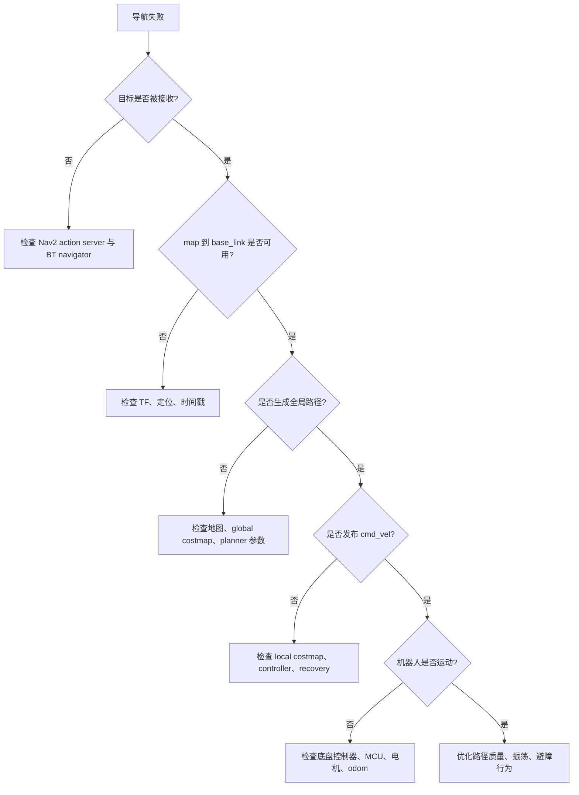

# ROS2 导航调试手册

## 目标

建立调试 ROS2 机器人系统的能力，而不是只会运行 launch 文件。本文重点服务目标 SoC 上的建图、定位和 Nav2 链路。

## 通信模型

| 机制 | 适用场景 | 机器人示例 | 调试命令 |
| --- | --- | --- | --- |
| Topic | 连续数据流 | `/scan`, `/odom`, `/tf`, `/cmd_vel`, camera images | `ros2 topic info/hz/bw/echo` |
| Service | 请求-响应式配置或查询 | 保存地图、清理 costmap、lifecycle 状态切换 | `ros2 service list/type/call` |
| Action | 长时间任务，带反馈和结果 | `NavigateToPose`、回桩、建图任务 | `ros2 action list/info/send_goal` |
| Parameter | 运行时配置 | Nav2 costmap、controller、SLAM 参数 | `ros2 param list/get/set/dump` |

## 最小命令工作流

每次出现导航问题，先按下面顺序采集信息：

```bash
ros2 node list
ros2 topic list -t
ros2 action list -t
ros2 service list -t
ros2 topic hz /scan
ros2 topic hz /odom
ros2 topic hz /cmd_vel
ros2 run tf2_ros tf2_echo map base_link
ros2 lifecycle nodes
```

再采集证据：

```bash
ros2 bag record \
  /scan \
  /odom \
  /tf \
  /tf_static \
  /map \
  /cmd_vel
```

确认真实话题名后，再加入 Nav2 和 AI 相关话题。

## QoS 检查清单

平台迁移时很容易出现 QoS 不匹配，尤其是替换传感器驱动或 DDS 实现后。

| 字段 | 含义 | 典型用途 | 故障现象 |
| --- | --- | --- | --- |
| Reliability | reliable 或 best effort | 传感器流常用 best effort；控制/状态常用 reliable | 订阅端收不到消息或消息延迟 |
| History/depth | 队列策略与深度 | 高频传感器数据需要有限队列 | 旧数据被延迟处理 |
| Durability | volatile 或 transient local | `/tf_static` 和类似 latched 的数据 | 后启动节点拿不到静态 TF |
| Deadline | 期望更新周期 | 健康监控 | 出现 deadline missed 警告 |
| Lifespan | 消息有效时间 | 对时效敏感的感知结果 | 使用了过期 AI 或传感器数据 |

实用检查：

```bash
ros2 topic info /scan --verbose
ros2 topic info /map --verbose
ros2 topic info /tf_static --verbose
```

需要记录这些关键话题的发布端和订阅端 QoS：

- `/scan`
- `/odom`
- `/tf`
- `/tf_static`
- `/map`
- `/cmd_vel`
- object detection topic
- depth image topic

## Executor 与 Callback Group 观察点

下面现象可能指向 executor 或 callback 调度问题：

- Topic 频率正常，但处理输出延迟。
- `/cmd_vel` 成批出现。
- 相机或 NPU 节点阻塞其他 callback。
- CPU 繁忙时 Nav2 feedback 卡住。
- Lifecycle transition service 超时。

关键节点需要回答这些问题：

| Node | Executor | Callback group | 长耗时 callback | 风险 |
| --- | --- | --- | --- | --- |
| SLAM node | 待补充 | 待补充 | scan matching, optimization | 位姿滞后 |
| Nav2 controller | 待补充 | 待补充 | controller loop | 控制抖动 |
| Base controller | 待补充 | 待补充 | serial/CAN I/O | 运动延迟 |
| YOLO node | 待补充 | 待补充 | inference/postprocess | 感知延迟 |

如果某个节点既有高频输入又有重处理逻辑，要检查 callback 是否被无意串行化。

## Lifecycle Node 检查清单

Nav2 大量依赖 lifecycle node。导航失败可能只是某个节点卡在错误状态。

命令：

```bash
ros2 lifecycle nodes
ros2 lifecycle get /controller_server
ros2 lifecycle get /planner_server
ros2 lifecycle get /bt_navigator
ros2 lifecycle get /behavior_server
```

正常导航时的期望状态：

- `planner_server`: active
- `controller_server`: active
- `bt_navigator`: active
- `behavior_server`: active
- map/localization nodes: active 或等价运行状态

如果节点是 inactive 或 unconfigured，优先检查 launch 顺序、参数、地图文件、plugin 加载和缺失 TF。

## rosbag2 复现流程

### 1. 采集

围绕故障发生时间录制短 bag：

```bash
ros2 bag record \
  /scan \
  /odom \
  /tf \
  /tf_static \
  /map \
  /cmd_vel \
  /goal_pose
```

同时保存：

```bash
ros2 node list > nodes.txt
ros2 topic list -t > topics.txt
ros2 param dump /controller_server > controller_server.params.yaml
ros2 param dump /planner_server > planner_server.params.yaml
ros2 param dump /bt_navigator > bt_navigator.params.yaml
```

### 2. 回放

```bash
ros2 bag info bag_directory
ros2 bag play bag_directory --clock
```

如有需要，让节点使用模拟时间：

```bash
ros2 param set /node_name use_sim_time true
```

### 3. 对比

对比 RDK X5 与目标 SoC：

- Topic 频率和带宽。
- TF 连续性。
- 回放时 CPU 占用。
- Nav2 日志和状态切换。
- 同一个 bag 是否复现同一个问题。

## 导航问题决策树



## 交付物

- 当前系统的 Node/Topic/Action/Service 地图。
- 所有关键话题的 QoS 表。
- rosbag2 采集与回放流程。
- 一个可复现问题的证据与根因记录。
