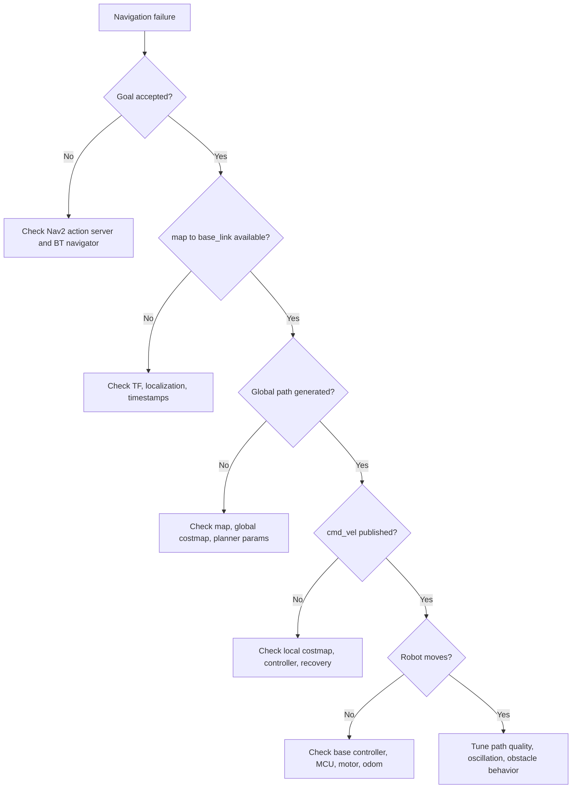

# ROS2 Navigation Debugging Guide

## Goal

Build the ability to debug a ROS2 robot system, not just run launch files. The
focus is the mapping, localization, and Nav2 chain on the target SoC.

## Communication model

| Mechanism | Use when | Robot examples | Debug command |
| --- | --- | --- | --- |
| Topic | Continuous data stream | `/scan`, `/odom`, `/tf`, `/cmd_vel`, camera images | `ros2 topic info/hz/bw/echo` |
| Service | Request-response configuration or query | save map, clear costmap, lifecycle transition | `ros2 service list/type/call` |
| Action | Long-running task with feedback/result | `NavigateToPose`, docking, mapping task | `ros2 action list/info/send_goal` |
| Parameter | Runtime configuration | Nav2 costmap, controller, SLAM params | `ros2 param list/get/set/dump` |

## Minimum command workflow

Run this sequence whenever a navigation issue appears:

```bash
ros2 node list
ros2 topic list -t
ros2 action list -t
ros2 service list -t
ros2 topic hz /scan
ros2 topic hz /odom
ros2 topic hz /cmd_vel
ros2 run tf2_ros tf2_echo map base_link
ros2 lifecycle nodes
```

Then capture evidence:

```bash
ros2 bag record \
  /scan \
  /odom \
  /tf \
  /tf_static \
  /map \
  /cmd_vel
```

Add Nav2 and AI topics after confirming real topic names.

## QoS checklist

QoS mismatches are common during platform migration, especially when replacing
sensor drivers or DDS implementations.

| Field | Meaning | Typical use | Failure symptom |
| --- | --- | --- | --- |
| Reliability | reliable vs best effort | Sensor streams often best effort; control/status often reliable | Subscriber sees no messages or delayed messages |
| History/depth | Queue policy and size | High-rate sensor data needs bounded depth | Old data processed late |
| Durability | volatile vs transient local | `/tf_static` and latched-like data | Static transforms missing for late subscribers |
| Deadline | Expected update interval | Health monitoring | Deadline missed warnings |
| Lifespan | Message validity window | Time-sensitive perception | Stale AI or sensor data |

Practical checks:

```bash
ros2 topic info /scan --verbose
ros2 topic info /map --verbose
ros2 topic info /tf_static --verbose
```

Record the publisher and subscriber QoS for:

- `/scan`
- `/odom`
- `/tf`
- `/tf_static`
- `/map`
- `/cmd_vel`
- object detection topic
- depth image topic

## Executor and callback group notes

Symptoms that may point to executor or callback scheduling issues:

- Topic rate is normal but processing output is late.
- `/cmd_vel` appears in bursts.
- Camera or NPU node blocks other callbacks.
- Nav2 feedback freezes while CPU is busy.
- Lifecycle transition service times out.

Questions to answer for important nodes:

| Node | Executor | Callback groups | Long callbacks | Risk |
| --- | --- | --- | --- | --- |
| SLAM node | TBD | TBD | scan matching, optimization | Pose lag |
| Nav2 controller | TBD | TBD | controller loop | Command jitter |
| Base controller | TBD | TBD | serial/CAN I/O | Motion delay |
| YOLO node | TBD | TBD | inference/postprocess | Perception delay |

If a node has high-rate input and heavy processing, check whether callbacks are
serialized unintentionally.

## Lifecycle node checklist

Nav2 depends heavily on lifecycle nodes. A navigation failure can be caused by a
node stuck in the wrong state.

Commands:

```bash
ros2 lifecycle nodes
ros2 lifecycle get /controller_server
ros2 lifecycle get /planner_server
ros2 lifecycle get /bt_navigator
ros2 lifecycle get /behavior_server
```

Expected states during normal navigation:

- `planner_server`: active
- `controller_server`: active
- `bt_navigator`: active
- `behavior_server`: active
- map/localization nodes: active or equivalent running state

If a node is inactive or unconfigured, inspect launch order, parameters, map
files, plugin loading, and missing TF frames.

## rosbag2 reproduction workflow

### 1. Capture

Record a short bag around the failure.

```bash
ros2 bag record \
  /scan \
  /odom \
  /tf \
  /tf_static \
  /map \
  /cmd_vel \
  /goal_pose
```

Also save:

```bash
ros2 node list > nodes.txt
ros2 topic list -t > topics.txt
ros2 param dump /controller_server > controller_server.params.yaml
ros2 param dump /planner_server > planner_server.params.yaml
ros2 param dump /bt_navigator > bt_navigator.params.yaml
```

### 2. Replay

```bash
ros2 bag info bag_directory
ros2 bag play bag_directory --clock
```

Set nodes to use simulated time if required:

```bash
ros2 param set /node_name use_sim_time true
```

### 3. Compare

Compare RDK X5 and target SoC:

- Topic rate and bandwidth.
- TF continuity.
- CPU usage during replay.
- Nav2 logs and state transitions.
- Whether the same bag produces the same failure.

## Navigation issue decision tree



## Deliverables

- Node/topic/action/service map for the current system.
- QoS table for all critical topics.
- rosbag2 capture and replay procedure.
- One reproduced issue with evidence and root-cause notes.
