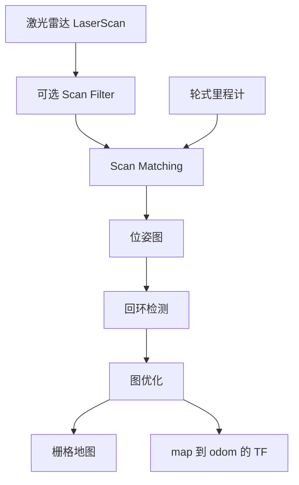

# SLAM 与定位指南

## 目标

深入理解当前基于 `slam_toolbox` 的方案，能够在目标 SoC 上定位建图与定位异常。

## 核心数据流



## 最小概念集

| 概念 | 需要理解什么 | 出错时的项目现象 |
| --- | --- | --- |
| LaserScan | 角度范围、距离范围、frame、时间戳 | 地图畸变、障碍物缺失 |
| Odometry | 基于轮子的短期运动估计 | 漂移、定位不稳定 |
| Scan matching | 将当前 scan 与历史/地图数据对齐 | 位姿跳变、跟踪失败 |
| Pose graph | 节点是机器人位姿，边是约束 | 地图误差累积 |
| Loop closure | 检测是否回到已访问区域 | 大回环无法闭合 |
| Optimization | 修正位姿图累计误差 | 地图弯曲或重影 |
| TF | map、odom、base、laser 的关系 | extrapolation error、无法定位 |

## 数据质量检查清单

调 SLAM 参数之前，先确认数据质量。

### LaserScan

```bash
ros2 topic hz /scan
ros2 topic echo /scan --once
ros2 topic info /scan --verbose
```

检查：

- `header.frame_id` 与 TF 中的 laser frame 一致。
- `angle_min`、`angle_max`、`angle_increment` 合理。
- `range_min` 和 `range_max` 与激光雷达规格一致。
- 频率稳定。
- 运动过程中没有长时间间隙。

### Odometry

```bash
ros2 topic hz /odom
ros2 topic echo /odom --once
ros2 run tf2_ros tf2_echo odom base_link
```

检查：

- 线速度和角速度方向与机器人真实运动一致。
- 机器人静止时 odom 不跳变。
- `odom -> base_link` 连续。
- 轮径、轮距、编码器方向和单位正确。

### TF

```bash
ros2 run tf2_tools view_frames
ros2 run tf2_ros tf2_echo map base_link
ros2 run tf2_ros tf2_echo base_link laser
```

检查：

- 没有缺失的静态变换。
- 同一 frame pair 没有重复 TF 发布者。
- 没有时间戳漂移或未来时间戳。

## 建图故障表

| 现象 | 可能层级 | 首先检查 | 常见修复 |
| --- | --- | --- | --- |
| 地图旋转或镜像 | TF / 安装方向 | `base_link -> laser`、odom 方向 | 修正静态 TF 或编码器方向 |
| 地图有双墙 | Odom / scan matching | `/odom`、`/scan`、scan matcher 日志 | 校准 odom，调整 scan 参数 |
| 走廊场景地图漂移 | 特征少 | scan 质量、回环 | 增加特征、调参、改善 odom |
| 回环失败 | SLAM 参数 / 环境 | pose graph、scan 重叠度 | 调整回环阈值 |
| 地图停止更新 | ROS2 / 数据 | `/scan` 频率、节点日志 | 修驱动/QoS/lifecycle |
| 建图时 CPU 突增 | SoC 性能 | CPU、内存、scan 频率 | 降低 scan 频率/分辨率，调整优化器 |

## 定位故障表

| 现象 | 可能原因 | 证据 |
| --- | --- | --- |
| 机器人位姿跳变 | scan match 失败、TF 问题、odom 跳变 | `/tf`、`/odom`、SLAM 日志 |
| 快速转向后丢定位 | 控制/odom 不匹配、scan 延迟 | `/cmd_vel`、`/odom`、`/scan` 时间戳 |
| RDK X5 正常但目标 SoC 异常 | 时序、DDS、CPU 负载、驱动 | topic hz/bw、CPU、rosbag 回放 |
| local costmap 偏移 | TF frame 不匹配 | frame tree 和 costmap global frame |
| 定位延迟 | CPU 负载或 callback 阻塞 | perf/top、topic 时间戳 |

## 参数实验模板

| 参数 | 基线 | 测试值 | 场景 | 结果 | 是否保留 |
| --- | --- | --- | --- | --- | --- |
| scan rate | 待补充 | 待补充 | 走廊 | 待补充 | 待补充 |
| map resolution | 待补充 | 待补充 | 完整地图 | 待补充 | 待补充 |
| loop closure threshold | 待补充 | 待补充 | 回环路线 | 待补充 | 待补充 |
| scan matcher search window | 待补充 | 待补充 | 快速转向 | 待补充 | 待补充 |
| transform timeout | 待补充 | 待补充 | 目标 SoC | 待补充 | 待补充 |

规则：

- 一次只改一个变量。
- 修改前后都录 rosbag。
- 对比时使用同一条路线。
- 记录 CPU、内存、地图质量和定位稳定性。

## 场景测试矩阵

| 场景 | 目的 | 必要证据 |
| --- | --- | --- |
| 直线走廊 | Odom 与 scan 一致性 | map image、`/odom`、`/scan` |
| 狭窄通道 | Costmap 与 scan 精度 | costmap、map、机器人视频 |
| 快速旋转 | TF/时间戳/odom 鲁棒性 | `/tf`、`/odom`、`/scan` |
| 回环路线 | Loop closure | pose graph/map 结果 |
| 动态障碍 | 建图鲁棒性 | rosbag 和地图变化 |
| 长时间运行 | 漂移与资源稳定性 | CPU/内存/地图随时间变化 |

## 源码学习路径

按这个顺序学习 `slam_toolbox`：

1. 节点输入/输出接口。
2. 参数和 launch 文件。
3. scan callback 与位姿更新路径。
4. 地图发布路径。
5. 序列化/保存地图路径。
6. 回环检测与优化入口。

不要一上来通读源码。先从运行时数据路径入手，只在回答具体问题时进入源码。

## 交付物

- 实际项目的 SLAM 数据流图。
- 建图失败案例集合。
- 定位问题检查清单。
- 带修改前后证据的参数调优日志。
