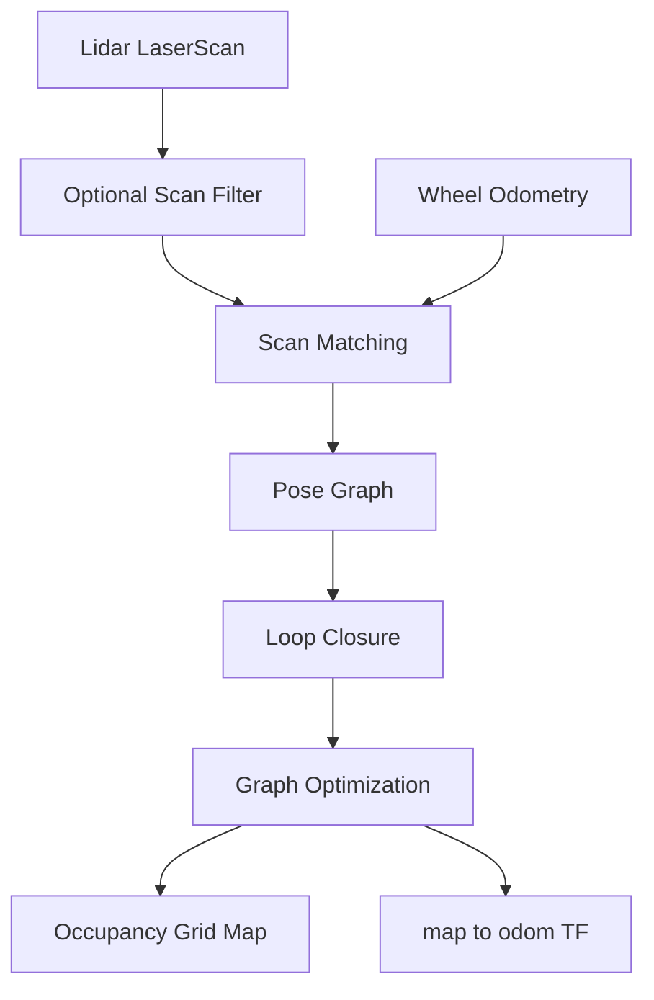

# SLAM and Localization Guide

## Goal

Understand the current `slam_toolbox` based solution deeply enough to debug
mapping and localization failures on the target SoC.

## Core data flow



## Minimum concepts

| Concept | What to understand | Project symptom when wrong |
| --- | --- | --- |
| LaserScan | Angle range, range limits, frame, timestamp | Map distortion, missing obstacles |
| Odometry | Wheel-based short-term motion estimate | Drift, localization instability |
| Scan matching | Align current scan with previous/map data | Pose jump, failed tracking |
| Pose graph | Nodes are robot poses, edges are constraints | Map accumulates error |
| Loop closure | Detect revisited places | Long-loop map does not close |
| Optimization | Correct accumulated pose graph error | Map bends or overlaps |
| TF | Relationship among map, odom, base, laser | Extrapolation errors, no localization |

## Data quality checklist

Before changing SLAM parameters, check data quality.

### LaserScan

```bash
ros2 topic hz /scan
ros2 topic echo /scan --once
ros2 topic info /scan --verbose
```

Check:

- `header.frame_id` equals the laser frame in TF.
- `angle_min`, `angle_max`, `angle_increment` are reasonable.
- `range_min` and `range_max` match the lidar.
- Rate is stable.
- No long gaps during movement.

### Odometry

```bash
ros2 topic hz /odom
ros2 topic echo /odom --once
ros2 run tf2_ros tf2_echo odom base_link
```

Check:

- Linear and angular velocity directions match real robot movement.
- Odom does not jump when robot is still.
- `odom -> base_link` is continuous.
- Wheel radius, wheel base, encoder direction, and units are correct.

### TF

```bash
ros2 run tf2_tools view_frames
ros2 run tf2_ros tf2_echo map base_link
ros2 run tf2_ros tf2_echo base_link laser
```

Check:

- No missing static transform.
- No duplicate TF publishers for the same frame pair.
- No timestamp drift or future timestamp.

## Mapping failure table

| Symptom | Likely layer | First checks | Typical fixes |
| --- | --- | --- | --- |
| Map is rotated or mirrored | TF / mounting | `base_link -> laser`, odom direction | Fix static TF or encoder direction |
| Map has double walls | Odom / scan matching | `/odom`, `/scan`, scan matcher logs | Calibrate odom, tune scan params |
| Map drifts in corridor | Feature-poor scene | scan quality, loop closure | Add landmarks, adjust params, improve odom |
| Loop closure fails | SLAM params / environment | pose graph, scan overlap | Tune loop closure thresholds |
| Map stops updating | ROS2/data | `/scan` rate, node logs | Fix driver/QoS/lifecycle |
| CPU spikes during mapping | SoC performance | CPU, memory, scan rate | Reduce scan rate/resolution, tune optimizer |

## Localization failure table

| Symptom | Likely cause | Evidence |
| --- | --- | --- |
| Robot pose jumps | Bad scan match, TF issue, odom jump | `/tf`, `/odom`, SLAM logs |
| Robot lost after fast turn | Controller/odom mismatch, scan lag | `/cmd_vel`, `/odom`, `/scan` timestamps |
| Localization works on RDK X5 but not target SoC | Timing, DDS, CPU load, driver | topic hz/bw, CPU, rosbag replay |
| Local costmap shifted | TF frame mismatch | frame tree and costmap global frame |
| Localization delayed | CPU load or callback blocking | perf/top, topic timestamps |

## Parameter study template

| Parameter | Baseline | Test value | Scenario | Result | Keep? |
| --- | --- | --- | --- | --- | --- |
| scan rate | TBD | TBD | Corridor | TBD | TBD |
| map resolution | TBD | TBD | Full map | TBD | TBD |
| loop closure threshold | TBD | TBD | Return loop | TBD | TBD |
| scan matcher search window | TBD | TBD | Fast turn | TBD | TBD |
| transform timeout | TBD | TBD | Target SoC | TBD | TBD |

Rules:

- Change one variable at a time.
- Record rosbag before and after.
- Use the same route for comparisons.
- Record CPU, memory, map quality, and localization stability.

## Scenario test matrix

| Scenario | Purpose | Required evidence |
| --- | --- | --- |
| Straight corridor | Odom and scan consistency | map image, `/odom`, `/scan` |
| Narrow passage | Costmap and scan precision | costmap, map, robot video |
| Fast rotation | TF/timestamp/odom robustness | `/tf`, `/odom`, `/scan` |
| Loop route | Loop closure | pose graph/map result |
| Dynamic obstacles | Mapping robustness | rosbag and map changes |
| Long run | Drift and resource stability | CPU/memory/map over time |

## Source learning path

Study `slam_toolbox` in this order:

1. Node input/output interfaces.
2. Parameters and launch files.
3. Scan callback and pose update path.
4. Map publication path.
5. Serialization/save-map path.
6. Loop closure and optimization entry points.

Do not start with full-source reading. Start from the runtime data path and only
enter source code to answer specific questions.

## Deliverables

- SLAM data-flow diagram for the actual project.
- Mapping failure case collection.
- Localization issue checklist.
- Parameter tuning log with before/after evidence.
