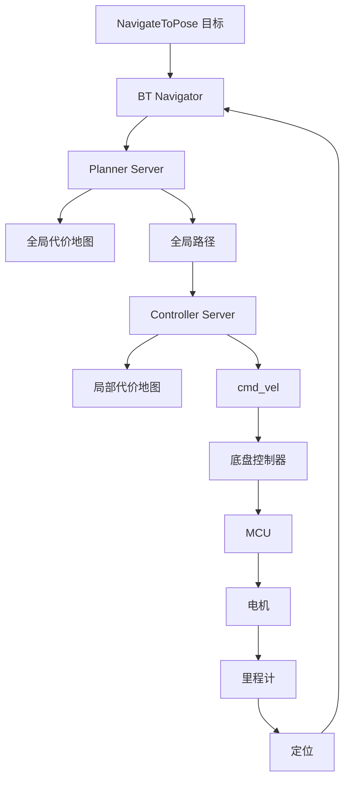

# Nav2 调试手册

## 目标

具备解释和调试完整导航链路的能力：

```text
目标点 -> 行为树 -> 全局规划器 -> 全局代价地图 -> 控制器 ->
局部代价地图 -> cmd_vel -> 底盘控制器 -> MCU -> 电机 -> 里程计
```

## Nav2 执行链路



## 关键模块

| 模块 | 职责 | 需要查看的证据 |
| --- | --- | --- |
| BT Navigator | 编排导航行为 | action feedback、BT 日志 |
| Planner Server | 计算全局路径 | global path topic、planner 日志 |
| Controller Server | 跟踪路径并输出速度 | `/cmd_vel`、controller 日志 |
| Global Costmap | 表示地图级障碍物 | costmap topic/RViz |
| Local Costmap | 表示近距离动态障碍物 | local costmap topic/RViz |
| Behavior Server | 执行恢复行为 | recovery 日志 |
| Lifecycle Manager | 启停 Nav2 节点 | lifecycle 状态 |

## 标准证据包

每次导航失败都要采集：

```bash
ros2 action list -t
ros2 topic hz /cmd_vel
ros2 topic echo /cmd_vel --once
ros2 run tf2_ros tf2_echo map base_link
ros2 lifecycle nodes
ros2 param dump /planner_server
ros2 param dump /controller_server
ros2 param dump /global_costmap/global_costmap
ros2 param dump /local_costmap/local_costmap
```

录制 rosbag 时包含：

- `/tf`
- `/tf_static`
- `/map`
- `/scan`
- `/odom`
- `/cmd_vel`
- global costmap topic
- local costmap topic
- global path topic
- goal topic/action feedback，如果可用

## 故障诊断表

| 现象 | 最可能区域 | 首先检查 |
| --- | --- | --- |
| 目标被拒绝 | Action server / BT navigator | action info、lifecycle 状态 |
| 目标接收但没有路径 | Planner / map / global costmap | map、global costmap、planner 日志 |
| 有路径但不动 | Controller / local costmap / TF | `/cmd_vel`、local costmap、TF |
| `/cmd_vel` 有输出但机器人不动 | Base controller / MCU / motor | MCU 日志、odom、串口/CAN |
| 机器人原地旋转 | 朝向、local planner、TF、odom | yaw error、odom 方向、controller 日志 |
| 机器人撞障碍 | local costmap、inflation、sensor frame | `/scan`、costmap layers、TF |
| 机器人避障过度 | inflation radius 或 footprint 过大 | footprint、costmap 参数 |
| 机器人振荡 | controller 调参、速度限制 | controller 参数、`/cmd_vel` 曲线 |
| Recovery 反复执行 | 上游故障未解决 | BT 状态、recovery 原因 |
| RDK X5 正常但目标 SoC 异常 | 时序/性能/平台 | topic rate、CPU、DDS、日志 |

## Costmap 检查清单

### Frames

- `global_frame` 应该匹配期望的全局参考系，通常是 `map`。
- `robot_base_frame` 应该匹配 `base_link` 或项目定义的底盘 frame。
- 传感器观测必须能变换到 costmap frame。

### Footprint

- footprint 必须匹配机器人真实外形。
- 如果外凸传感器或保险杠会影响碰撞，需要纳入。
- 过小：有碰撞风险。
- 过大：过不去窄通道。

### Obstacle layer

检查：

- source topic 名称。
- sensor frame。
- marking 和 clearing 开关。
- obstacle range 与 raytrace range。
- QoS 兼容性。

### Inflation layer

检查：

- inflation radius。
- cost scaling factor。
- 窄通道是否被膨胀层堵死。

## Controller 调参清单

改动前先记录基线：

| 参数组 | 影响 | 错误时的现象 |
| --- | --- | --- |
| 速度限制 | 最大线速度/角速度 | 太慢、不安全、振荡 |
| 加速度限制 | 平滑性与电机可执行性 | 运动突兀、过冲 |
| 目标容差 | 何时认为到达目标 | 永远不成功、停止不准 |
| Path alignment critic | 路径跟随倾向 | 抄近路或过度修正 |
| Obstacle critic | 障碍物避让 | 碰撞或过度保守 |

规则：

- 在固定测试地图上调参。
- 使用相同起点和目标点。
- 保留 rosbag 和视频进行对比。
- 调 controller 之前，先确认 odom 与真实运动一致。

## Behavior Tree 检查点

需要回答：

- 加载的是哪个 BT XML？
- 启用了哪些 recovery behavior？
- 重试策略是什么？
- 什么条件触发 clear costmap？
- BT 是否区分 planning failure 和 control failure？
- recovery action 对真实机器人是否安全？

## 场景测试

| 场景 | 目的 | 通过标准 |
| --- | --- | --- |
| 直线目标点 | 基础 controller 与 odom | 平滑运动并到达目标 |
| 原地转向 | 角速度控制 | 不振荡、无 TF 错误 |
| 窄通道 | Footprint/costmap | 安全通过或正确拒绝 |
| 动态障碍 | local costmap | 能停车/避让且不碰撞 |
| 路径被堵 | recovery behavior | 能恢复或清晰报告失败 |
| 长路线 | planner 与定位 | 不丢定位，路径稳定 |

## 交付物

- 实际项目的 Nav2 执行链路图。
- Planner、controller、costmap、BT 的参数基线。
- 导航故障排查手册。
- 至少五个场景的测试报告和实测结果。
