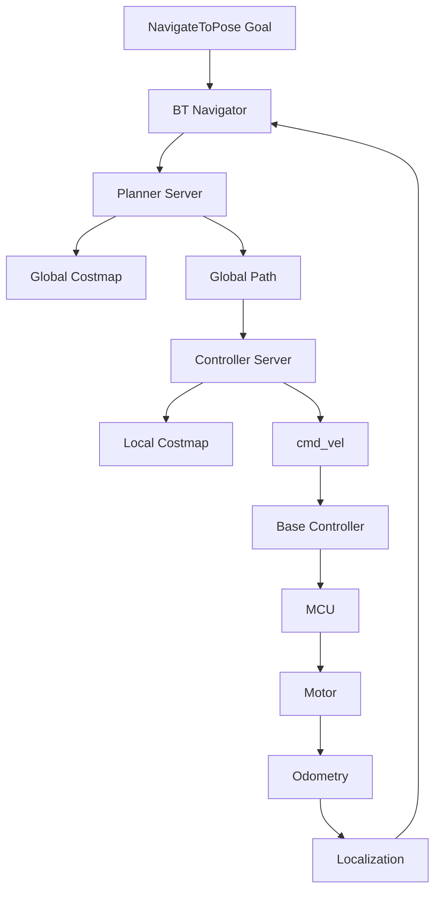

# Nav2 Debugging Guide

## Goal

Build the ability to explain and debug the full navigation chain:

```text
Goal -> Behavior Tree -> Planner -> Global Costmap -> Controller ->
Local Costmap -> cmd_vel -> Base Controller -> MCU -> Motor -> Odom
```

## Nav2 execution chain



## Key modules

| Module | Responsibility | Evidence to inspect |
| --- | --- | --- |
| BT Navigator | Orchestrates navigation behavior | action feedback, BT logs |
| Planner Server | Computes global path | global path topic, planner logs |
| Controller Server | Tracks path and emits velocity | `/cmd_vel`, controller logs |
| Global Costmap | Represents map-level obstacles | costmap topic/RViz |
| Local Costmap | Represents nearby dynamic obstacles | local costmap topic/RViz |
| Behavior Server | Recovery behaviors | recovery logs |
| Lifecycle Manager | Starts/stops Nav2 nodes | lifecycle state |

## Standard evidence bundle

For every navigation failure, collect:

```bash
ros2 action list -t
ros2 topic hz /cmd_vel
ros2 topic echo /cmd_vel --once
ros2 run tf2_ros tf2_echo map base_link
ros2 lifecycle nodes
ros2 param dump /planner_server
ros2 param dump /controller_server
ros2 param dump /global_costmap/global_costmap
ros2 param dump /local_costmap/local_costmap
```

Record a rosbag with:

- `/tf`
- `/tf_static`
- `/map`
- `/scan`
- `/odom`
- `/cmd_vel`
- global costmap topic
- local costmap topic
- global path topic
- goal topic/action feedback if available

## Failure diagnosis table

| Symptom | Most likely area | First checks |
| --- | --- | --- |
| Goal rejected | Action server / BT navigator | action info, lifecycle state |
| Goal accepted but no path | Planner / map / global costmap | map, global costmap, planner logs |
| Path exists but no movement | Controller / local costmap / TF | `/cmd_vel`, local costmap, TF |
| `/cmd_vel` exists but robot still | Base controller / MCU / motor | MCU logs, odom, serial/CAN |
| Robot rotates in place | Orientation, local planner, TF, odom | yaw error, odom direction, controller logs |
| Robot hits obstacle | local costmap, inflation, sensor frame | `/scan`, costmap layers, TF |
| Robot avoids too much | inflation radius or footprint too large | footprint, costmap params |
| Robot oscillates | controller tuning, velocity limits | controller params, `/cmd_vel` profile |
| Recovery repeats | upstream failure not fixed | BT status, recovery reason |
| Works on RDK X5 but not target SoC | timing/performance/platform | topic rate, CPU, DDS, logs |

## Costmap checklist

### Frames

- `global_frame` should match the intended global reference, often `map`.
- `robot_base_frame` should match `base_link` or the project-defined base.
- Sensor observations must transform into the costmap frame.

### Footprint

- Footprint must match the real robot body.
- Include protruding sensors or bumper if they affect collision.
- Too small: collision risk.
- Too large: cannot pass narrow spaces.

### Obstacle layer

Check:

- Source topic name.
- Sensor frame.
- Marking and clearing flags.
- Obstacle range and raytrace range.
- QoS compatibility.

### Inflation layer

Check:

- Inflation radius.
- Cost scaling factor.
- Whether narrow passages become blocked.

## Controller tuning checklist

Record baseline values before changes:

| Parameter group | What it affects | Failure when wrong |
| --- | --- | --- |
| Velocity limits | Max linear/angular speed | too slow, unsafe, oscillation |
| Acceleration limits | Smoothness and motor feasibility | jerky movement, overshoot |
| Goal tolerances | When goal is considered reached | never succeeds, inaccurate stop |
| Path alignment critic | Preference to follow path | cuts corners or overcorrects |
| Obstacle critic | Obstacle avoidance | collision or overly conservative path |

Rules:

- Tune on a fixed test map.
- Use the same start and goal points.
- Keep rosbag and video for comparison.
- Check whether odom and physical movement match before tuning controller.

## Behavior Tree review

Questions to answer:

- Which BT XML is loaded?
- Which recovery behaviors are enabled?
- What is the retry policy?
- What conditions trigger clearing costmap?
- Does the BT distinguish planning failure and control failure?
- Are recovery actions safe for the physical robot?

## Scenario tests

| Scenario | Purpose | Pass criteria |
| --- | --- | --- |
| Straight goal | Basic controller and odom | Smooth movement, reaches goal |
| Turn-in-place | Angular control | No oscillation, no TF error |
| Narrow passage | Footprint/costmap | Passes safely or rejects correctly |
| Dynamic obstacle | local costmap | Stops/avoids without collision |
| Blocked path | recovery behavior | Recovers or reports failure clearly |
| Long route | planner and localization | No lost pose, stable path |

## Deliverables

- Nav2 execution chain diagram for the actual project.
- Parameter baseline for planner, controller, costmaps, and BT.
- Navigation failure troubleshooting manual.
- Test report with at least five scenarios and measured results.
