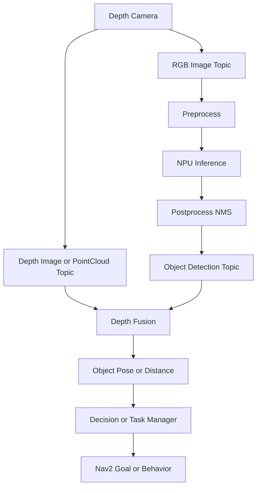

# YOLO, NPU, Depth Camera, and Navigation Integration

## Goal

Understand how AI perception enters robot behavior. The owner of mapping and
navigation does not need to own model training, but must understand the system
contract among camera, YOLO/NPU, depth, task manager, and navigation.

## Data flow



## Interface contract

Define the contract before debugging behavior.

| Interface | Required fields | Questions |
| --- | --- | --- |
| RGB image | timestamp, frame_id, encoding, width, height | Is timestamp close to capture time? |
| Depth image/point cloud | timestamp, frame_id, depth unit, camera info | Is depth aligned with RGB? |
| Detection output | class, confidence, bbox, timestamp, frame_id | Is bbox from original or resized image? |
| Object pose | x/y/z, frame_id, covariance or confidence | Which frame is used? |
| Task event | object id/type, action, priority | Is it one-shot or continuous? |
| Nav2 goal | pose, frame_id, behavior constraints | Is goal reachable and safe? |

## Suggested detection message fields

If the project does not already define a message, evaluate whether these fields
are enough:

```text
std_msgs/Header header
string model_name
Detection[] detections

Detection:
  string class_name
  int32 class_id
  float32 confidence
  float32 xmin
  float32 ymin
  float32 xmax
  float32 ymax
  float32 distance_m
  geometry_msgs/PoseStamped object_pose
```

Rules:

- Always include `header.stamp`.
- Always include `header.frame_id`.
- Clarify whether bounding boxes are in original image coordinates.
- Publish confidence and class id/name.
- Keep inference latency as a metric, not a hidden log.

## Time and frame alignment

AI results are only useful for navigation if time and frame semantics are clear.

Checklist:

- RGB and depth timestamps are close enough for the robot speed.
- Detection timestamp refers to image capture time, not publish time, or the
  difference is recorded.
- Object pose is transformed into `base_link`, `odom`, or `map` before decision.
- TF has camera extrinsics: `base_link -> camera_link`.
- Depth unit is known and documented.
- Inference latency is measured and exposed.

Commands:

```bash
ros2 topic hz /camera/color/image_raw
ros2 topic hz /camera/depth/image_raw
ros2 topic hz /detections
ros2 topic echo /detections --once
ros2 run tf2_ros tf2_echo base_link camera_link
```

## Latency budget

| Segment | Metric | Target | Actual | Notes |
| --- | --- | --- | --- | --- |
| Camera capture | frame interval | TBD | TBD | sensor driver |
| Image transport | publish to subscribe | TBD | TBD | DDS/QoS |
| Preprocess | ms/frame | TBD | TBD | resize/normalize |
| NPU inference | ms/frame | TBD | TBD | model/runtime |
| Postprocess | ms/frame | TBD | TBD | NMS/boxes |
| Depth fusion | ms/frame | TBD | TBD | bbox to depth |
| Decision | ms/event | TBD | TBD | task manager |
| Nav2 response | ms/goal | TBD | TBD | action accept |

A slow detector can still be acceptable for semantic goals, but may be unsafe
for fast obstacle avoidance. Do not use delayed AI output as a hard real-time
collision-avoidance source unless the latency and failure modes are proven.

## How AI results can influence navigation

| Use case | AI role | Navigation interface | Risk |
| --- | --- | --- | --- |
| Object finding | Detect target object | Send Nav2 goal near object | false positives, bad depth |
| Person following | Track person | Velocity command or local goal | latency, safety |
| Semantic navigation | Identify room/object | Task manager selects waypoint | stale detection |
| Dynamic obstacle hint | Detect obstacle type | Costmap layer or behavior | delayed obstacle update |
| Docking/approach | Detect marker/object | short-range control behavior | frame calibration |

For safety-critical obstacle avoidance, prefer lidar/depth-based costmap as the
primary source and use YOLO as semantic context.

## Failure diagnosis table

| Symptom | Likely cause | Evidence |
| --- | --- | --- |
| Detection appears but task does nothing | Interface mismatch, task filter, topic name | detection topic, task logs |
| Object distance is wrong | RGB-depth alignment, depth unit, bbox scaling | camera info, depth sample |
| Object pose jumps | timestamp mismatch, TF, noisy depth | header stamps, tf echo |
| Navigation target is unreachable | bad object-to-map transform or unsafe goal | RViz, costmap, goal pose |
| Nav2 reacts late to AI result | inference latency or task scheduling | latency budget, CPU load |
| Works alone but fails with navigation | resource contention | CPU/NPU/memory, topic hz |

## Collaboration questions for teammate A

Ask these early:

- Which model, input size, and runtime are used?
- What are the output topic names and message types?
- Does detection timestamp use capture time or publish time?
- Is depth aligned to RGB?
- What is the measured inference latency and FPS on target SoC?
- Does NPU execution block CPU threads?
- How are dropped frames handled?
- Is there a confidence threshold and class filter?

## Deliverables

- Perception-to-decision interface document.
- Detection/depth/pose topic inventory.
- AI latency budget.
- One end-to-end test: object detection triggers a task or navigation behavior.
