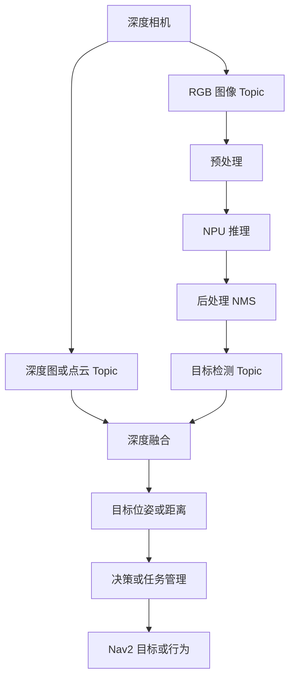

# YOLO、NPU、深度相机与导航集成

## 目标

理解 AI 感知如何进入机器人行为闭环。负责建图和导航的人不一定要负责模型训练，但必须理解相机、YOLO/NPU、深度、任务管理和导航之间的系统契约。

## 数据流



## 接口契约

调试行为之前，先定义接口契约。

| 接口 | 必要字段 | 需要回答的问题 |
| --- | --- | --- |
| RGB image | timestamp, frame_id, encoding, width, height | 时间戳是否接近采集时间？ |
| Depth image/point cloud | timestamp, frame_id, depth unit, camera info | 深度是否与 RGB 对齐？ |
| Detection output | class, confidence, bbox, timestamp, frame_id | bbox 来自原图还是 resize 后图像？ |
| Object pose | x/y/z, frame_id, covariance 或 confidence | 使用哪个坐标系？ |
| Task event | object id/type, action, priority | 是一次性事件还是连续事件？ |
| Nav2 goal | pose, frame_id, behavior constraints | 目标是否可达且安全？ |

## 推荐 Detection 消息字段

如果项目还没有定义消息，可以评估下面字段是否足够：

```text
std_msgs/Header header
string model_name
Detection[] detections

Detection:
  string class_name
  int32 class_id
  float32 confidence
  float32 xmin
  float32 ymin
  float32 xmax
  float32 ymax
  float32 distance_m
  geometry_msgs/PoseStamped object_pose
```

规则：

- 必须包含 `header.stamp`。
- 必须包含 `header.frame_id`。
- 明确 bounding box 是否使用原始图像坐标。
- 发布 confidence 和 class id/name。
- 推理延迟应该作为指标暴露，而不是只藏在日志里。

## 时间与坐标系对齐

AI 结果只有在时间和坐标语义清楚时，才对导航有价值。

检查清单：

- RGB 和 depth 时间戳对当前机器人速度来说足够接近。
- Detection 时间戳指的是图像采集时间，而不是发布时间；如果不是，需要记录差值。
- Object pose 在进入决策前，要能变换到 `base_link`、`odom` 或 `map`。
- TF 中存在相机外参：`base_link -> camera_link`。
- 深度单位明确并写入文档。
- 推理延迟有测量和暴露。

命令：

```bash
ros2 topic hz /camera/color/image_raw
ros2 topic hz /camera/depth/image_raw
ros2 topic hz /detections
ros2 topic echo /detections --once
ros2 run tf2_ros tf2_echo base_link camera_link
```

## 延迟预算

| 环节 | 指标 | 目标 | 实测 | 备注 |
| --- | --- | --- | --- | --- |
| Camera capture | frame interval | 待补充 | 待补充 | sensor driver |
| Image transport | publish to subscribe | 待补充 | 待补充 | DDS/QoS |
| Preprocess | ms/frame | 待补充 | 待补充 | resize/normalize |
| NPU inference | ms/frame | 待补充 | 待补充 | model/runtime |
| Postprocess | ms/frame | 待补充 | 待补充 | NMS/boxes |
| Depth fusion | ms/frame | 待补充 | 待补充 | bbox to depth |
| Decision | ms/event | 待补充 | 待补充 | task manager |
| Nav2 response | ms/goal | 待补充 | 待补充 | action accept |

慢速检测器可以用于语义目标，但未必适合快速避障。除非延迟和失效模式已经被证明，否则不要把延迟较大的 AI 输出作为硬实时避障来源。

## AI 结果如何影响导航

| 使用场景 | AI 角色 | 导航接口 | 风险 |
| --- | --- | --- | --- |
| 寻找物体 | 检测目标物体 | 发送靠近物体的 Nav2 goal | 误检、深度错误 |
| 跟随人 | 跟踪人 | 速度指令或局部目标 | 延迟、安全 |
| 语义导航 | 识别房间/物体 | Task manager 选择 waypoint | 过期检测 |
| 动态障碍提示 | 检测障碍物类别 | Costmap layer 或行为 | 障碍物更新延迟 |
| 回桩/靠近 | 检测标记或物体 | 近距离控制行为 | 坐标系标定 |

对安全关键的避障，优先使用 lidar/depth-based costmap 作为主来源，YOLO 作为语义上下文。

## 故障诊断表

| 现象 | 可能原因 | 证据 |
| --- | --- | --- |
| 检测结果存在但任务无动作 | 接口不匹配、任务过滤、topic 名错误 | detection topic、task logs |
| 物体距离错误 | RGB-depth 未对齐、深度单位错误、bbox 缩放错误 | camera info、depth sample |
| 物体位姿跳变 | 时间戳不匹配、TF、深度噪声 | header stamps、tf echo |
| 导航目标不可达 | object 到 map 的变换错误或目标不安全 | RViz、costmap、goal pose |
| Nav2 对 AI 结果反应慢 | 推理延迟或任务调度延迟 | latency budget、CPU load |
| 单独运行正常，和导航一起运行失败 | 资源竞争 | CPU/NPU/内存、topic hz |

## 与同事 A 的协作问题

尽早确认：

- 使用哪个模型、输入尺寸和 runtime？
- 输出 topic 名称和消息类型是什么？
- Detection 时间戳使用采集时间还是发布时间？
- depth 是否与 RGB 对齐？
- 目标 SoC 上实测推理延迟和 FPS 是多少？
- NPU 执行是否会阻塞 CPU 线程？
- 掉帧如何处理？
- confidence threshold 和 class filter 是什么？

## 交付物

- 感知到决策的接口文档。
- Detection/depth/pose topic 盘点。
- AI 延迟预算。
- 一个端到端测试：物体检测触发任务或导航行为。
