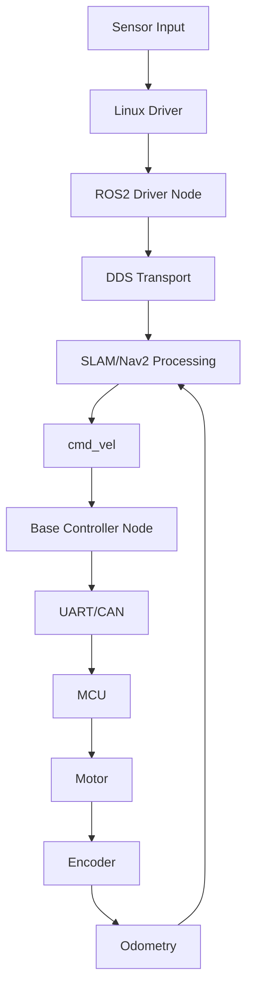

# SoC Migration and Performance Baseline

## Goal

Turn the RDK X5 to target ARM CPU + NPU SoC migration into measurable platform
engineering work. The key is to distinguish platform limitations from ROS2,
SLAM, Nav2, AI, and MCU issues.

## Migration comparison matrix

| Area | RDK X5 | Target SoC | Difference | Risk | Evidence |
| --- | --- | --- | --- | --- | --- |
| CPU architecture | TBD | TBD | TBD | Scheduling/perf | `lscpu` |
| CPU frequency/governor | TBD | TBD | TBD | Latency/power | `cpufreq-info`, sysfs |
| Memory | TBD | TBD | TBD | SLAM/Nav2/camera pressure | `free -h`, `vmstat` |
| Storage | TBD | TBD | TBD | logs, map load, bag write | `iostat` |
| NPU runtime | TBD | TBD | TBD | YOLO latency | NPU SDK logs |
| Camera driver | TBD | TBD | TBD | frame drop/timestamp | `dmesg`, topic hz |
| Lidar driver | TBD | TBD | TBD | scan loss | `dmesg`, topic hz |
| UART/CAN to MCU | TBD | TBD | TBD | control delay | bus logs |
| Ubuntu version | TBD | TBD | TBD | dependency compatibility | `lsb_release -a` |
| ROS2 distro | TBD | TBD | TBD | package compatibility | package list |
| DDS implementation | TBD | TBD | TBD | QoS/latency | env and packages |

## Performance baseline script checklist

Collect these values before optimization:

```bash
date
uname -a
lsb_release -a
lscpu
free -h
df -h
ip addr
ros2 node list
ros2 topic list -t
ros2 doctor --report
```

Runtime sampling:

```bash
top -b -n 1
pidstat -durh 1 10
vmstat 1 10
iostat -xz 1 10
dmesg -T | tail -n 200
journalctl -b --no-pager | tail -n 300
```

ROS2 sampling:

```bash
ros2 topic hz /scan
ros2 topic hz /odom
ros2 topic hz /cmd_vel
ros2 topic bw /scan
ros2 topic bw /odom
ros2 topic info /scan --verbose
ros2 topic info /tf --verbose
```

## Critical latency chain



Measure each edge when possible:

| Segment | Measurement method | Common issue |
| --- | --- | --- |
| Sensor to driver | kernel timestamps, driver logs | dropped frames/scans |
| Driver to ROS node | node logs, message timestamps | timestamp mismatch |
| DDS transport | topic hz/bw, rosbag | QoS mismatch, congestion |
| SLAM/Nav2 processing | node CPU, logs, callback timing | CPU saturation |
| `/cmd_vel` to base controller | topic echo and node log | callback delay |
| Base controller to MCU | UART/CAN log | packet loss/retry |
| MCU to odom | odom rate and encoder log | unit or direction mismatch |

## Long-run stability plan

Minimum long-run tests:

| Test | Duration target | Evidence | Failure criteria |
| --- | --- | --- | --- |
| Idle ROS graph | TBD | CPU/memory logs | Memory growth, node crash |
| Mapping loop | TBD | map, rosbag, CPU/memory | map corruption, CPU runaway |
| Nav2 repeated goals | TBD | success rate, cmd_vel, odom | failed goals, recovery loop |
| Camera + YOLO + navigation | TBD | FPS, inference latency, nav result | delayed control, dropped topics |
| Voice + task + navigation | TBD | task logs, action result | wrong task or stuck state |

Track:

- Node crashes.
- Memory growth.
- CPU thermal throttling.
- Topic rate degradation.
- TF extrapolation frequency.
- MCU communication errors.
- DDS warnings.

## Optimization rules

1. Define a baseline before changing anything.
2. Change one variable per experiment.
3. Keep the same route, map, goal, and load profile.
4. Record before/after metrics.
5. Separate performance, stability, and functional correctness.

## Common target SoC risks

| Risk | Why it matters | Evidence | Mitigation |
| --- | --- | --- | --- |
| Lower CPU single-thread perf | SLAM and Nav2 callbacks may lag | CPU flame/perf/top | reduce rate, tune executor, optimize node |
| Memory bandwidth pressure | Camera + NPU + SLAM compete | FPS drop, system load | reduce resolution, isolate pipelines |
| DDS behavior difference | Topics may disappear or lag | verbose topic info | align QoS, test DDS config |
| Timestamp mismatch | TF extrapolation and localization failure | message headers | unify time source |
| Driver maturity | sensors unstable on new SoC | dmesg, node restart | driver fixes, retry strategy |
| NPU runtime blocking CPU | Navigation loop jitter | pidstat/perf | async inference, thread isolation |
| Thermal throttling | long-run performance drops | temp/frequency logs | cooling, governor, workload tuning |

## Platform issue vs algorithm issue

Use this separation rule:

- If the same rosbag fails on both platforms, suspect algorithm/config/data.
- If the same rosbag fails only on target SoC, suspect runtime, DDS, CPU, package,
  or dependency differences.
- If live data fails but rosbag replay succeeds, suspect driver, sensor timing,
  MCU link, or hardware environment.
- If `/cmd_vel` is normal but robot does not move, suspect base controller, MCU,
  motor, power, or odom feedback.

## Deliverables

- RDK X5 and target SoC baseline report.
- Platform difference matrix.
- Latency chain measurement notes.
- Long-run stability report.
- Optimization record with before/after data.
