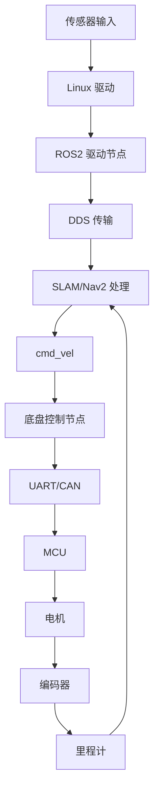

# SoC 迁移与性能基线

## 目标

把从 RDK X5 到目标 ARM CPU + NPU SoC 的迁移变成可量化的平台工程工作。关键是区分平台限制、ROS2、SLAM、Nav2、AI 和 MCU 问题。

## 迁移对比矩阵

| 领域 | RDK X5 | 目标 SoC | 差异 | 风险 | 证据 |
| --- | --- | --- | --- | --- | --- |
| CPU 架构 | 待补充 | 待补充 | 待补充 | 调度/性能 | `lscpu` |
| CPU 频率/governor | 待补充 | 待补充 | 待补充 | 延迟/功耗 | `cpufreq-info`, sysfs |
| 内存 | 待补充 | 待补充 | 待补充 | SLAM/Nav2/相机压力 | `free -h`, `vmstat` |
| 存储 | 待补充 | 待补充 | 待补充 | 日志、地图加载、bag 写入 | `iostat` |
| NPU runtime | 待补充 | 待补充 | 待补充 | YOLO 延迟 | NPU SDK logs |
| 相机驱动 | 待补充 | 待补充 | 待补充 | 掉帧/时间戳 | `dmesg`, topic hz |
| 雷达驱动 | 待补充 | 待补充 | 待补充 | scan 丢失 | `dmesg`, topic hz |
| UART/CAN 到 MCU | 待补充 | 待补充 | 待补充 | 控制延迟 | bus logs |
| Ubuntu 版本 | 待补充 | 待补充 | 待补充 | 依赖兼容性 | `lsb_release -a` |
| ROS2 发行版 | 待补充 | 待补充 | 待补充 | 包兼容性 | package list |
| DDS 实现 | 待补充 | 待补充 | 待补充 | QoS/延迟 | env and packages |

## 性能基线采集清单

优化前先采集这些值：

```bash
date
uname -a
lsb_release -a
lscpu
free -h
df -h
ip addr
ros2 node list
ros2 topic list -t
ros2 doctor --report
```

运行时采样：

```bash
top -b -n 1
pidstat -durh 1 10
vmstat 1 10
iostat -xz 1 10
dmesg -T | tail -n 200
journalctl -b --no-pager | tail -n 300
```

ROS2 采样：

```bash
ros2 topic hz /scan
ros2 topic hz /odom
ros2 topic hz /cmd_vel
ros2 topic bw /scan
ros2 topic bw /odom
ros2 topic info /scan --verbose
ros2 topic info /tf --verbose
```

## 关键延迟链路



尽可能测量每条边：

| 链路 | 测量方式 | 常见问题 |
| --- | --- | --- |
| Sensor 到 driver | kernel 时间戳、driver 日志 | 掉帧/丢 scan |
| Driver 到 ROS node | node 日志、消息时间戳 | 时间戳不匹配 |
| DDS transport | topic hz/bw、rosbag | QoS 不匹配、拥塞 |
| SLAM/Nav2 processing | 节点 CPU、日志、callback 耗时 | CPU 饱和 |
| `/cmd_vel` 到 base controller | topic echo 和节点日志 | callback 延迟 |
| Base controller 到 MCU | UART/CAN 日志 | 丢包/重试 |
| MCU 到 odom | odom 频率和编码器日志 | 单位或方向错误 |

## 长稳测试计划

最低长稳测试：

| 测试 | 目标时长 | 证据 | 失败标准 |
| --- | --- | --- | --- |
| 空闲 ROS graph | 待补充 | CPU/内存日志 | 内存增长、节点崩溃 |
| 建图循环 | 待补充 | map、rosbag、CPU/内存 | 地图异常、CPU 失控 |
| Nav2 重复目标点 | 待补充 | 成功率、cmd_vel、odom | 目标失败、recovery 循环 |
| 相机 + YOLO + 导航 | 待补充 | FPS、推理延迟、导航结果 | 控制延迟、topic 掉帧 |
| 语音 + 任务 + 导航 | 待补充 | task 日志、action 结果 | 任务错误或状态卡死 |

跟踪：

- 节点崩溃。
- 内存增长。
- CPU 温度降频。
- Topic 频率下降。
- TF extrapolation 频率。
- MCU 通信错误。
- DDS 警告。

## 优化规则

1. 改动前先定义基线。
2. 每次实验只改一个变量。
3. 保持相同路线、地图、目标点和负载。
4. 记录优化前后指标。
5. 分开看性能、稳定性和功能正确性。

## 目标 SoC 常见风险

| 风险 | 为什么重要 | 证据 | 缓解方式 |
| --- | --- | --- | --- |
| CPU 单线程性能较低 | SLAM 和 Nav2 callback 可能滞后 | CPU flame/perf/top | 降频率、调 executor、优化节点 |
| 内存带宽压力 | 相机 + NPU + SLAM 争抢资源 | FPS 下降、系统负载升高 | 降分辨率、隔离 pipeline |
| DDS 行为差异 | Topic 可能消失或延迟 | verbose topic info | 对齐 QoS，测试 DDS 配置 |
| 时间戳不匹配 | TF extrapolation 与定位失败 | message headers | 统一时间源 |
| 驱动成熟度不足 | 新 SoC 上传感器不稳定 | dmesg、节点重启 | 修驱动、增加重试策略 |
| NPU runtime 阻塞 CPU | 导航控制环抖动 | pidstat/perf | 异步推理、线程隔离 |
| 温度降频 | 长稳性能下降 | 温度/频率日志 | 散热、governor、负载调优 |

## 平台问题与算法问题的区分

使用下面规则：

- 同一个 rosbag 在两个平台都失败，优先怀疑算法、配置或数据。
- 同一个 rosbag 只在目标 SoC 失败，优先怀疑 runtime、DDS、CPU、软件包或依赖差异。
- 实时数据失败但 rosbag 回放成功，优先怀疑驱动、传感器时序、MCU 链路或硬件环境。
- `/cmd_vel` 正常但机器人不动，优先怀疑底盘控制器、MCU、电机、电源或 odom 反馈。

## 交付物

- RDK X5 与目标 SoC 基线报告。
- 平台差异矩阵。
- 延迟链路测量记录。
- 长稳测试报告。
- 带优化前后数据的优化记录。
